# 📦 **Boxed - Your Smart Home Inventory, Packing & Retrieval Assistant**

**Boxed** helps you _actually know_ where your stuff is. Create boxes, drop items in, add photos, tag types, collaborators, mark packed status, search instantly - then ask **BoxedAI** _“Where’s my winter jacket?”_ and get an answer sourced from your real inventory.

**Think “Notion for your physical belongings” with an AI locator + packing coach. 🚀**

<p align="center">
  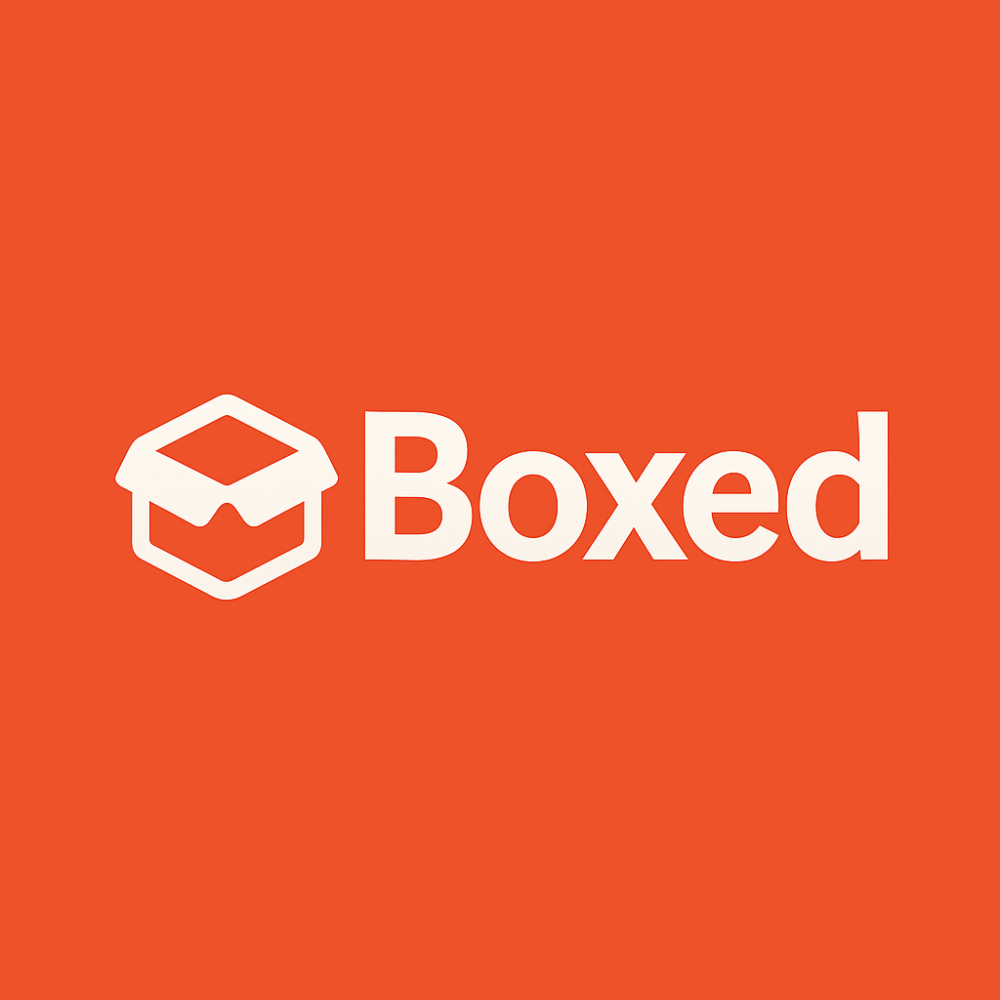
</p>

> [!IMPORTANT]
> Born out of the frustration of moving & forgetting which box had **that one cable**. Now, **Boxed** keeps every item queryable & context‑aware, hehe. ✨


## 📑 Table of Contents

1. [About Boxed](#-about-boxed)
2. [Core Features](#-core-features)
3. [BoxedAI](#-boxedai)
4. [Tech Stack](#-tech-stack)
5. [UI / UX Highlights](#-ui--ux-highlights)
6. [Data Model](#-data-model)
7. [Inventory Context Generation](#-inventory-context-generation)
8. [Getting Started](#-getting-started)
9. [Environment Variables](#-environment-variables)
10. [Development Scripts](#-development-scripts)
11. [CSV Export Format](#-csv-export-format)
12. [Docker & Containerization](#-docker--containerization)
13. [AWS & Terraform Deployment](#-aws--terraform-deployment)
    - [Ansible Playbooks](#-ansible-playbooks)
14. [Testing](#-testing)
15. [Kubernetes Integration](#-kubernetes-integration)
16. [GitHub Actions CI/CD](#-github-actions-cicd)
17. [Makefile & Shell Scripts](#-makefile--shell-scripts)
18. [Secrets Scanning](#-secrets-scanning)
19. [Contributing](#-contributing)
20. [License](#-license)
21. [Author](#-author)

## 🪄 About Boxed

Boxed is a **personal / household inventory & packing assistant** built on top of Supabase (auth, Postgres, storage) + a modern Next.js frontend.
It aims to eliminate: _“Which box has the charger?”_, _“Did I already pack those mugs?”_, _“Where did I put winter clothes?”_.

Use it while:

- Moving apartments
- Seasonal storage (winter vs. summer)
- Gear management (photography, hobby, tools)
- Shared spaces (roommates / family / team kit)
- College students managing dorm items (great when moving between semesters, or packing for breaks...)

All these features are designed to make the lives of movers, families, and especially college students easier, as I have been there myself - I often lost track of my belongings during moves and relocations, and I wish I had a tool like Boxed back then...

Boxed is built with a focus on **simplicity**, **usability**, and **AI-powered assistance** to help you find and pack your items efficiently.

### Live Demo

You can try out Boxed live at **[boxed-app.vercel.app](https://boxed-app.vercel.app).** Feel free to create an account and explore the features! 🚀

## ✨ Core Features

Boxed provides a comprehensive set of features to manage your home inventory and packing needs:

| Category           | Features                                                                                                                        |
| ------------------ | ------------------------------------------------------------------------------------------------------------------------------- |
| **Boxes**          | Create, rename inline, photo (upload/change/remove), set location, status (`packed` / `unpacked`), drag-to-reorder persistently |
| **Items**          | Add per box, quantity, optional photo, type classification, edit inline via modal (name/qty/photo)                              |
| **Types**          | Item types (e.g. _Clothing, Cables, Kitchen_) with pill color cycling                                                           |
| **Collaborators**  | Share access (data model prepared with `box_collaborators`)                                                                     |
| **Search**         | Debounced global item search with box context + empty & loading states                                                          |
| **Inline Editing** | Box name & location directly editable (shadcn + custom EditableText)                                                            |
| **Status Toggle**  | “Mark Packed / Mark Unpacked” pill-driven action                                                                                |
| **Photos**         | Box & item image storage via Supabase buckets                                                                                   |
| **Export**         | One-click export of all boxes + items → CSV (flattened rows)                                                                    |
| **Responsive Nav** | Collapses gracefully; spacing optimized for small screens                                                                       |
| **Tooltips**       | For destructive actions (e.g. remove photo)                                                                                     |
| **Dark / Light**   | Theme toggle integrated with tokenized OKLCH palette                                                                            |
| **Persistence**    | Drag order per user stored in `localStorage`                                                                                    |
| **Performance**    | Prompt-limited context generation, truncated lists for AI context                                                               |
| **AI Assistant**   | _BoxedAI_ chat bubble → inventory-aware retrieval & packing guidance                                                            |
| **Accessibility**  | Keyboard navigation, focus management, aria labels for screen readers                                                           |

## 🤖 BoxedAI

BoxedAI is our state-of-the-art, RAG-based AI assistant powered by Google AI. It helps you quickly locate items, suggest packing strategies, and answer questions about your inventory.

| Capability              | Description                                                                                    |
| ----------------------- | ---------------------------------------------------------------------------------------------- |
| **Item Locator**        | Ask it questions like: “Where is my HDMI cable?”, “Which box has ceramic mugs?”                |
| **Packing Tips**        | Suggests categorization, padding, consolidation ideas                                          |
| **Context Awareness**   | Receives summarized + truncated inventory (boxes + items + collaborators)                      |
| **Clarification**       | If ambiguous or missing, asks follow-ups (instructed not to hallucinate)                       |
| **Language Matching**   | Replies in same language as user input                                                         |
| **Lightweight Session** | Frontend builds `history` array & sends to the AI with carefulyl engineered system instruction |

Our AI assistant is **prompt engineered** to be **fast**, **context-aware**, and **privacy-conscious**. It only uses the inventory data you provide, ensuring your personal information remains secure.

Additionally, BoxedAI is powered by **Retrieval-Augmented Generation (RAG)**, which means it can pull in relevant context from your inventory to provide accurate answers without hallucinating or making assumptions. This will help you find items quickly and efficiently, especially during stressful moving or packing situations!

## 🧱 Tech Stack

Boxed is built with a modern stack that emphasizes performance, usability, and developer experience. Here’s a breakdown of the key technologies used:

| Layer                   | Stack                                                                                                                |
| ----------------------- | -------------------------------------------------------------------------------------------------------------------- |
| **Frontend**            | Next.js (App/Pages hybrid depending), React 18, TypeScript                                                           |
| **Styling**             | Tailwind CSS, shadcn/ui component primitives                                                                         |
| **State / UX**          | Local state hooks, dnd-kit for box reordering, dayjs for relative time                                               |
| **Backend (Managed)**   | Supabase: Auth, Postgres, Storage, Row-level queries                                                                 |
| **AI**                  | Google Generative AI LLM                                                                                             |
| **Validation**          | Zod schemas for box/item/type parsing                                                                                |
| **Icons**               | Lucide-react                                                                                                         |
| **MD Rendering**        | react-markdown + remark-gfm (chat responses)                                                                         |
| **Animations (select)** | Framer Motion (earlier draggable variant) / CSS transitions                                                          |
| **Build & Deploy**      | Vercel (web) + Supabase managed infra + AWS for optional fully-managed deployment + Ansible for automated deployment |
| **Containerization**    | Docker for local dev + production images                                                                             |
| **CI/CD**               | GitHub Actions for automated testing, linting, and deployment                                                        |
| **Testing**             | Jest for unit tests, Playwright/Cypress (planned) for E2E tests                                                      |
| **Secrets Scanning**    | Trivy, GitHub Secrets Scanning, Yelp's secret scanning tools                                                         |

## 🖥 UI / UX Highlights

We focused on creating a clean, intuitive interface that makes managing your inventory a breeze. Here are some key UI/UX features:

- **Inventory Dashboard**: Drag re-order with handle hover (opacity reveal) - persists user order client-side.
- **Box Hero Header**: Gradient overlay + inline editable text + status pill + photo controls + tooltip for destructive photo removal.
- **ItemCard**: Photo / placeholder, quantity, relative “last used”, type pill, bottom-right edit pencil leading to modal.
- **Box List**: Infinite scroll with skeleton loading state, empty state, and search bar at the top.
- **Item Search**: Global search bar with debounced input, showing results across all boxes, with empty and loading states.
- **Editable Text**: Inline editing for box names and locations using shadcn EditableText component.
- **Item Edit Modal**: Name / quantity / photo choose → upload to bucket → optimistic closure.
- **Chat Dialog**: ScrollArea, Markdown bubbles, shift+enter newline, Enter send, inventory loading indicator.
- **Export CSV**: Flattened structure ready for spreadsheets or offline backup.
- **Responsive Design**: Mobile-first approach with collapsible navigation, optimized spacing, and touch-friendly controls.
- and so much more!

## 🗂️ User Interface

Boxed's user interface is designed to be intuitive and user-friendly, with a focus on simplicity and ease of use. Here are some key UI components:

### Landing Page

<p align="center">
  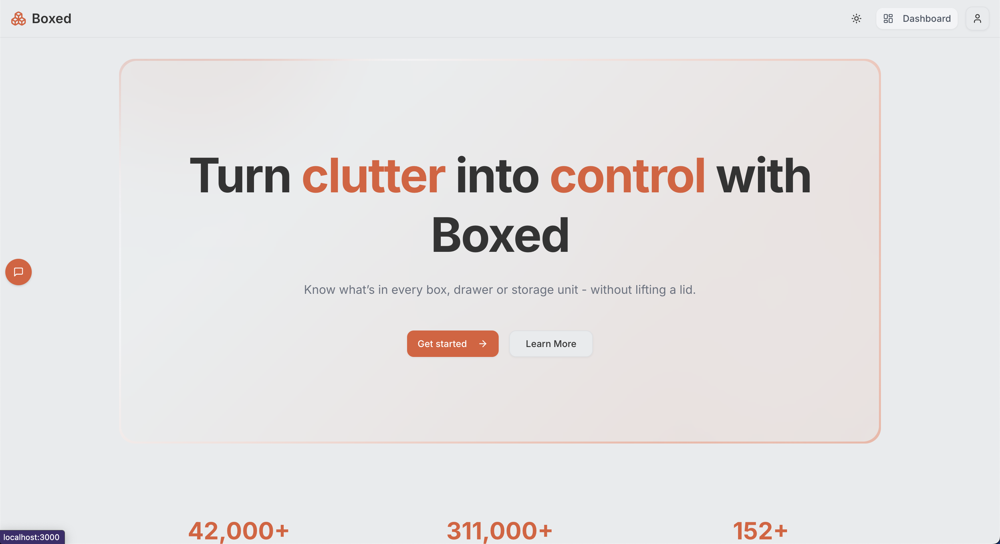
</p>

### Inventory Dashboard

<p align="center">
  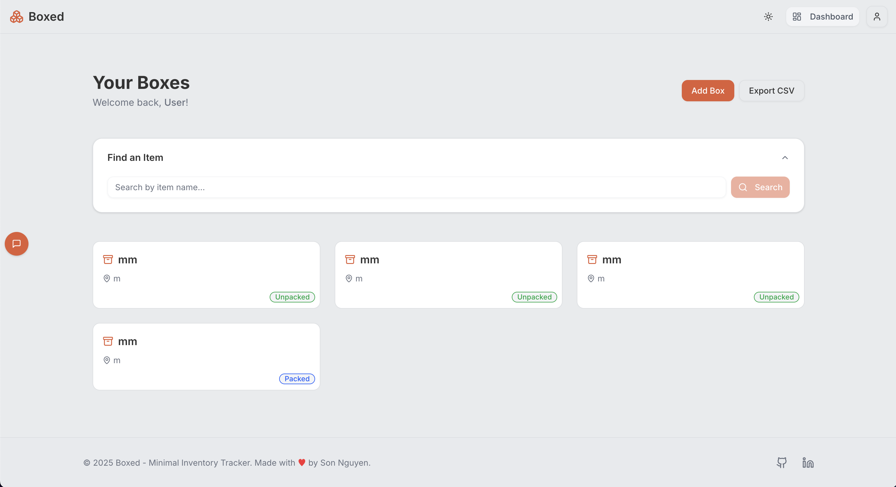
</p>

### Box Details

<p align="center">
  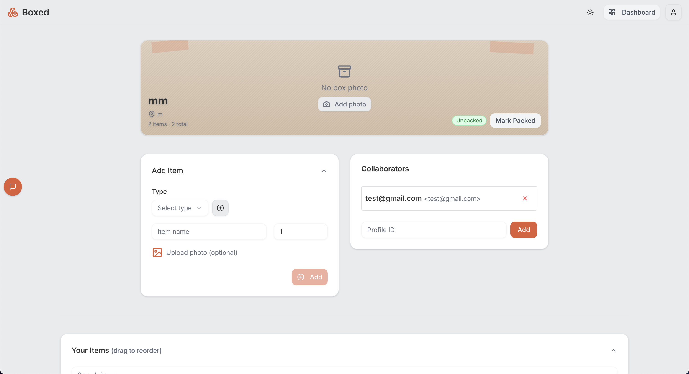
</p>

<p align="center">
  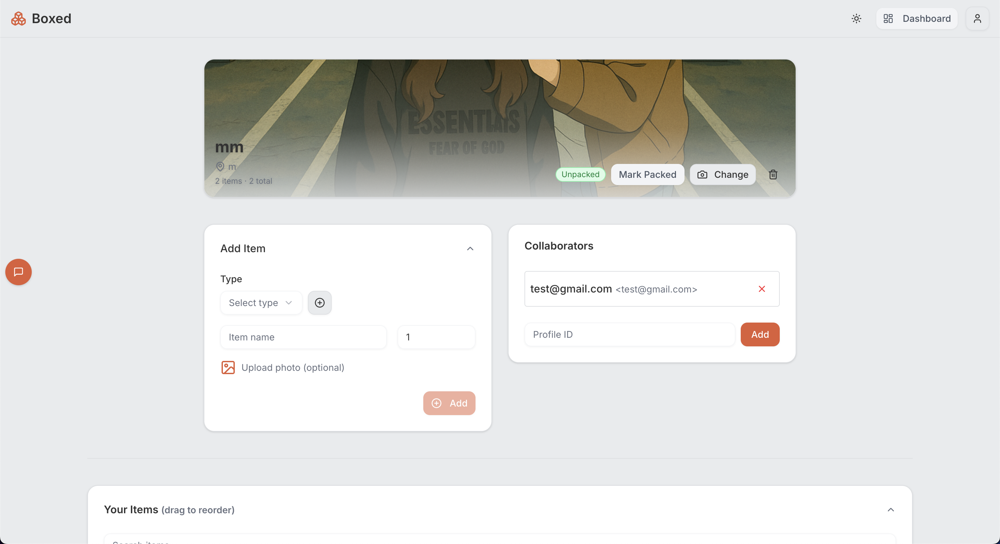
</p>

### Items

<p align="center">
  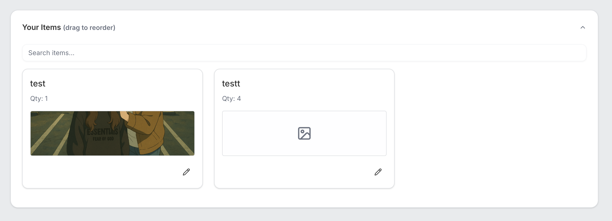
</p>

### Chatbot

<p align="center">
  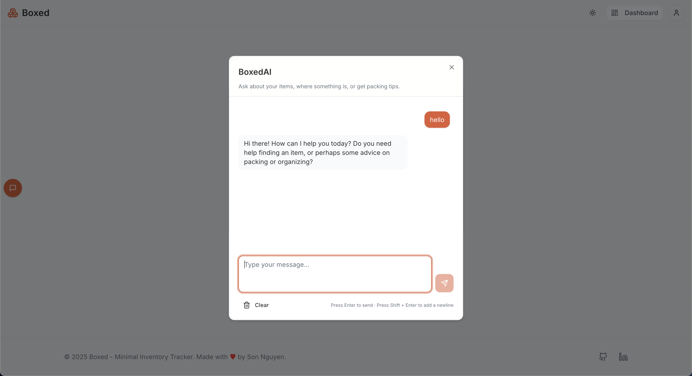
</p>

### Profile Settings

<p align="center">
  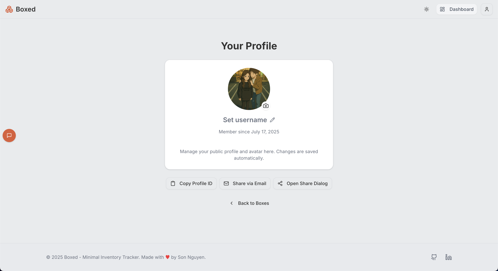
</p>

### Login

<p align="center">
  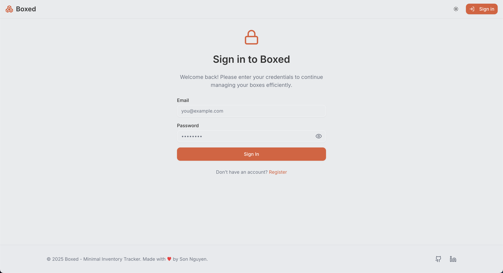
</p>

### Register

<p align="center">
  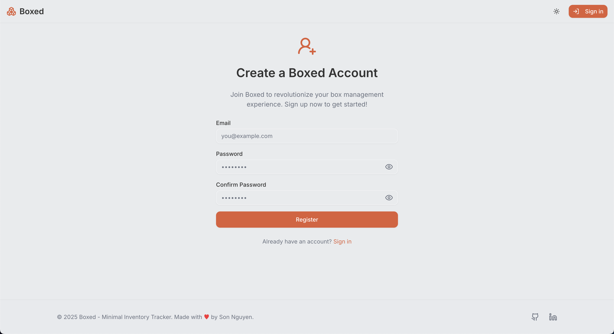
</p>

## 🗄 Data Model

Below is the core data model for Boxed, designed to be simple yet effective for managing boxes, items, and their relationships.

| Table                       | Key Fields                                                                                                           | Notes                             |
| --------------------------- | -------------------------------------------------------------------------------------------------------------------- | --------------------------------- |
| `profiles`                  | `id (uuid PK)`, `full_name`, `avatar_url`                                                                            | Supabase auth metadata (implicit) |
| `boxes`                     | `id uuid PK`, `owner_profile_id FK`, `name`, `location`, `status (packed/unpacked)`, `photo_url`, `created_at`       | Core container                    |
| `items`                     | `id uuid PK`, `box_id FK`, `type_id FK?`, `name`, `quantity int`, `photo_url`, `last_used (timestamp)`, `created_at` | Belongs to a box                  |
| `item_types`                | `id serial PK`, `name`                                                                                               | For classification pills          |
| `box_collaborators`         | `box_id FK`, `collaborator_profile_id FK`, `role`                                                                    | Multi-user future features        |
| _(optional)_ `activity_log` | `id`, `actor_id`, `entity_type`, `entity_id`, `action`, `ts`                                                         | For future auditing               |

<p align="center">
  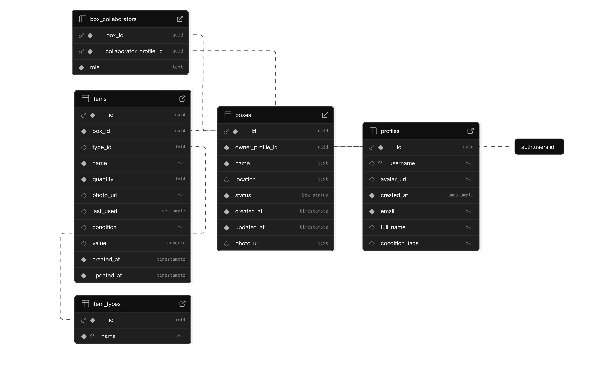
</p>

**Indexes you should have (recommended):**

```sql
CREATE INDEX ON boxes (owner_profile_id);
CREATE INDEX ON items (box_id);
CREATE INDEX ON items (name text_pattern_ops);
CREATE INDEX ON items (type_id);
CREATE INDEX ON box_collaborators (box_id);
```

> [!TIP]
> Creating indexes will significantly speed up queries, especially for larger datasets. Use `text_pattern_ops` for case-insensitive searches on `name`.

**Triggers you will want to add:**

```sql
-- 1. Add the column(s) your trigger needs
ALTER TABLE public.profiles
   ADD COLUMN IF NOT EXISTS email       TEXT    NOT NULL DEFAULT '',
   ADD COLUMN IF NOT EXISTS full_name   TEXT,
   ADD COLUMN IF NOT EXISTS condition_tags TEXT[] DEFAULT ARRAY[]::text[],
   ADD COLUMN IF NOT EXISTS created_at  timestamptz DEFAULT now();

-- 2. Redefine your trigger to target public.profiles
CREATE OR REPLACE FUNCTION public.handle_new_user()
  RETURNS trigger
  LANGUAGE plpgsql
  SECURITY DEFINER
  SET search_path = 'public, auth'
AS $$
BEGIN
INSERT INTO public.profiles (
   id,
   email,
   full_name,
   condition_tags,
   created_at
)
VALUES (
          NEW.id,
          NEW.email,
          COALESCE(NEW.raw_user_meta_data ->> 'name', NEW.email),
          ARRAY[]::text[],
          now()
       );
RETURN NEW;
END;
$$;

DROP TRIGGER IF EXISTS on_auth_user_created ON auth.users;
CREATE TRIGGER on_auth_user_created
   AFTER INSERT ON auth.users
   FOR EACH ROW
   EXECUTE PROCEDURE public.handle_new_user();
```

> [!NOTE]
> This trigger automatically creates a profile entry when a new user signs up via Supabase Auth. It uses the `email` and `name` from the auth metadata, defaulting to the email if no name is provided. It is very important to have this trigger in place to ensure that every user has a corresponding profile in the `profiles` table, which is essential for Boxed's functionality.

## 🧬 Inventory Context Generation

To support our AI assistant, we generate a **context summary** of the user's inventory and pass that via the RAG-method to the LLM to ensure the chatbot receives full context about the user's boxes and items. This is done client-side to minimize server load and latency.

1. Fetches **all boxes** owned by user.
2. Fetches **all items** for these boxes (batched).
3. Fetches **collaborators** (optional).
4. Truncates: max 30 boxes; max 25 items per box.
5. Produces summary lines like:

   ```
   Box: "Kitchen Essentials" (id:abc) status:packed loc:Pantry items:5 => Plates (qty 8), Glasses (qty 6), ...
   ```

6. Caches (via `localStorage`) for 60s to avoid re-pulling on every chat open.
7. Supplies to Google AI system instruction to ensure no hallucination, clarification if missing.
8. Uses `history` array to maintain conversation context.
9. Generates a **truncated** version of the inventory for the AI to use, ensuring it has enough context without overwhelming the model.
10. Uses `Zod` schemas to validate the data structure before sending it to the AI.

This approach ensures that the AI assistant has a clear understanding of the user's inventory, allowing it to provide accurate and helpful responses without overwhelming the model with too much data.

## 🚀 Getting Started

To get started with Boxed, follow these simple steps:

```bash
git clone https://github.com/hoangsonww/Boxed-Inventory-App.git
cd Boxed-Inventory-App

# 1. Install deps
npm install

cd web
npm install

# 2. Env
cp .env.local.example .env.local
# Fill in: NEXT_PUBLIC_SUPABASE_URL, NEXT_PUBLIC_SUPABASE_ANON_KEY, NEXT_PUBLIC_GOOGLE_AI_API_KEY

# 3. Run Dev
npm run dev
# -> http://localhost:3000

# 4. Supabase (if local)
# Use Supabase CLI (optional):
supabase start
# Alternatively, and recommended, use the hosted Supabase dashboard:
# Create a new project, copy the URL and anon key, and paste them into your .env.local
# Make sure to set up the database schema as per the Data Model section above.

# 5. Open in browser
# Open http://localhost:3000 in your browser to see Boxed in action!
```

> [!TIP]
> If you're using hosted Supabase dashboard, just paste URL + anon key in env file and skip local CLI.

## 🔐 Environment Variables

As mentioned, Boxed requires some environment variables to function properly. Here’s a quick reference:

| Var                             | Required         | Description                                |
| ------------------------------- | ---------------- | ------------------------------------------ |
| `NEXT_PUBLIC_SUPABASE_URL`      | ✅               | Supabase project URL                       |
| `NEXT_PUBLIC_SUPABASE_ANON_KEY` | ✅               | Public anon key                            |
| `NEXT_PUBLIC_GOOGLE_AI_API_KEY` | ✅               | Google Gemini API key                      |
| `SUPABASE_SERVICE_ROLE_KEY`     | ❌ (server only) | For server-side maintenance tasks          |
| `NEXT_PUBLIC_APP_NAME`          | ❌               | Branding override                          |
| `NEXT_PUBLIC_DEBUG_AI`          | ❌               | If `1`, console logs AI context (dev only) |

> [!NOTE]
> Some variables are only needed for server-side operations, like maintenance tasks or admin features. The `NEXT_PUBLIC_` prefix indicates they are safe to expose to the client.

> [!WARNING]
> NEVER expose sensitive keys like `SUPABASE_SERVICE_ROLE_KEY` to the client-side code!!!!

## 🧪 Development Scripts

Boxed comes with a set of convenient scripts to help you during development. Here’s a quick overview:

| Script          | Purpose                                   |
| --------------- | ----------------------------------------- |
| `dev`           | Run Next.js locally                       |
| `build`         | Production build                          |
| `start`         | Start production server                   |
| `lint`          | ESLint (run from root directory)          |
| `test`          | Run Jest tests in the `web` directory     |
| `test:watch`    | Run Jest tests in watch mode (web)        |
| `test:coverage` | Run Jest tests with coverage report (web) |
| `format`        | Prettier write (run from root directory)  |

Remember that you can only run `lint` or `format` from the root directory, as they are set up to lint/format both the `web` directory.

## 📤 CSV Export Format

Each row contains a flattened view of boxes and items, allowing for easy import into spreadsheets or other tools. The CSV format is designed to be simple yet comprehensive.

| Column           | Example                         |
| ---------------- | ------------------------------- |
| `box_id`         | `a8f9c8d1-...`                  |
| `box_name`       | `Kitchen Essentials`            |
| `box_location`   | `Pantry`                        |
| `box_status`     | `packed`                        |
| `item_id`        | `f23f...` or empty              |
| `item_name`      | `Ceramic Mug`                   |
| `item_quantity`  | `6`                             |
| `item_photo_url` | `https://...supabase.../object` |

Our CSV generation process is fully **client-side** (no server round trip), which uses `Blob` + `URL.createObjectURL` and reduces the need for server-side processing. This means you can export your inventory data quickly and easily, without any additional overhead.

## 🐬 Docker & Containerization

Boxed can be containerized using Docker for easy deployment and scalability. We provide a `Dockerfile` and `docker-compose.yml` to help you get started quickly.

To build and run Boxed in a Docker container, follow these steps:

```bash
cd web

# build the image
docker build -t your-username/boxed-web .

# run it
docker run -p 3000:3000 your-username/boxed-web
```

Alternatively, with `docker-compose`, you can run Boxed with a single command, from the root directory of the project:

```bash
docker-compose up --build -d
```

This will build the Docker image and start the Boxed web application on port 3000. You can then access it at `http://localhost:3000`.

## 🌐 AWS & Terraform Deployment

Boxed can be deployed to AWS using Terraform for infrastructure management. This allows you to run Boxed on a fully managed stack with high availability and scalability.

To facilitate this, we provide a Terraform configuration that sets up the necessary AWS resources, including:

- **VPC**: For network isolation
- **RDS**: For PostgreSQL database
- **S3**: For static file storage
- **IAM Roles**: For secure access control
- **CloudFront**: For CDN distribution
- **Route 53**: For DNS management
- **ECR**: For container registry
- **ECS**: For container orchestration

This setup allows you to run Boxed in a production environment with minimal effort. You can find the Terraform configuration in the `aws` directory of the repository, and the [AWS Deployment Guide](docs/aws-deployment.md) provides detailed instructions on how to set up and deploy Boxed on AWS.

### Ansible Playbooks

Boxed also includes optional Ansible playbooks for provisioning and managing the AWS infrastructure. These playbooks automate the setup of the necessary resources, making it easy to deploy Boxed on AWS.

To use the Ansible playbooks, you will need to have Ansible installed on your local machine. You can then run the playbooks to provision the AWS resources defined in the Terraform configuration.

We also have a `deploy.sh` script that automates the deployment process, including running the Terraform commands and applying the Ansible playbooks. For more details, checkout the `ansible/` directory in the repository.

## 🧪 Testing

Boxed includes a comprehensive suite of tests to ensure reliability and correctness. We use Jest for unit and integration tests, with the following structure:

1. **Unit Tests**: Cover individual components and functions.
2. **Integration Tests**: Test interactions between components and the Supabase backend.
3. **E2E Tests**: (planned) Use Playwright or Cypress to simulate user interactions and verify end-to-end functionality.

To run our existing **Jest** tests, simply execute:

```bash
cd web
npm run test
```

Alternatively, you can run tests in watch mode for continuous feedback during development:

```bash
npm run test:watch
```

Or, to generate a coverage report:

```bash
npm run test:coverage
```

This will run all tests and generate a coverage report in the `coverage` directory, which you can open in your browser to see which parts of the code are covered by tests.

## 🕸️ Kubernetes Integration

Boxed can also be deployed on Kubernetes for those who prefer container orchestration. We provide a `k8s` directory with the necessary YAML files to deploy Boxed on a Kubernetes cluster.

This includes:

- **Deployment**: For the Boxed application
- **Service**: To expose the application
- **Ingress**: For routing traffic to the application
- **ConfigMap**: For environment variables and configuration
- **Secret**: For sensitive information like API keys
- **PersistentVolumeClaim**: For database storage
- **HorizontalPodAutoscaler**: For scaling the application based on load
- **NetworkPolicy**: For securing the application
- **Resource Quotas**: To limit resource usage
- and more...

For more details, check the `kubernetes` directory in the repository. This setup allows you to run Boxed in a highly available and scalable manner, leveraging the power of Kubernetes.

## 🪈 GitHub Actions CI/CD

To ensure code quality and reliability, Boxed uses GitHub Actions for continuous integration and deployment. The CI/CD pipeline includes:

- **Linting**: Runs ESLint to check for code quality issues.
- **Testing**: Executes Jest tests to verify functionality.
- **Build**: Builds the Next.js application for production.
- **Deployment**: Deploys the application to Vercel or your chosen hosting provider.
- **Docker Build**: Builds the Docker image for Boxed and pushes it to the GH container registry.
- **Vulnerability Scanning**: Uses Trivy to scan the Docker image for vulnerabilities.
- and more...

You can find the GitHub Actions workflow files in the `.github/workflows` directory. These workflows are triggered on every push and pull request, ensuring that your code is always tested and ready for deployment.

<p align="center">
  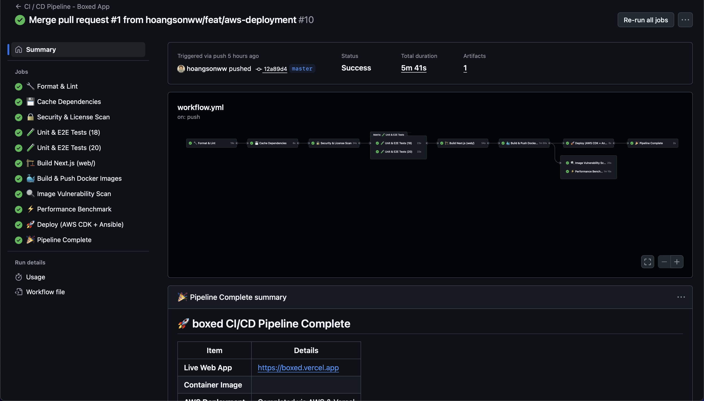
</p>

## 🎸 Makefile & Shell Scripts

To speed up your local development, infrastructure provisioning, and container workflow, Boxed provides a `Makefile` and a set of shell scripts under the `scripts/` directory.

### Makefile

| Command              | Description                                                                    |
| -------------------- | ------------------------------------------------------------------------------ |
| `make build-image`   | Build the Next.js app image (`boxed-web:latest`) from `web/Dockerfile`.        |
| `make compose-up`    | Start your local Docker Compose stack (`docker-compose up --build -d`).        |
| `make compose-down`  | Tear down the local Docker Compose stack.                                      |
| `make infra-init`    | Run `terraform init` in the `aws/` directory to initialize your workspace.     |
| `make infra-plan`    | Run `terraform plan -var="env=$(ENV)"` to preview changes (defaults to `dev`). |
| `make infra-apply`   | Apply your Terraform configuration (`terraform apply -auto-approve`).          |
| `make infra-destroy` | Destroy all Terraform-managed resources (`terraform destroy -auto-approve`).   |

You can override the environment by setting the `ENV` variable:

```bash
make infra-plan ENV=prod
```

### Shell Scripts

Boxed includes a few helper scripts in `scripts/` for common tasks:

- **scripts/start-dev.sh**

  ```bash
  #!/usr/bin/env bash
  # Start Postgres, Supabase emulators, and frontend
  docker-compose -f docker-compose.dev.yml up -d postgres supabase
  cd web && npm install && npm run dev
  ```

  Boots up your local Postgres & Supabase, then runs the Next.js dev server.

- **scripts/build-prod.sh**

  ```bash
  #!/usr/bin/env bash
  # Build production assets & Docker image
  cd web
  npm ci
  npm run build
  docker build --target runner -t boxed-web:prod -f Dockerfile .
  ```

  Installs dependencies, builds the Next.js app, and produces the production image.

- **scripts/deploy-aws.sh**

  ```bash
  #!/usr/bin/env bash
  # Deploy the latest Terraform changes to AWS
  set -e
  cd aws
  terraform init
  terraform apply -auto-approve -var="env=${1:-dev}"
  ```

  Applies your AWS infra changes. Pass an environment name (`dev`, `staging`, `prod`) as the first argument.

> [!TIP]
> Make all scripts executable with `chmod +x scripts/*.sh` and ensure you have the necessary AWS credentials and environment variables set.

## 🔒 Secrets Scanning

To ensure the security of our Boxed project, we use a wide range of technologies and practices to scan for secrets and vulnerabilities in our codebase. This includes:

1. **Trivy**: A powerful open-source vulnerability scanner that checks for known vulnerabilities in our Docker images and dependencies.
2. **GitHub Secrets Scanning**: Automatically scans for sensitive information in our GitHub repositories, such as API keys, passwords, and other secrets.
3. **GitGuardian**: A tool that helps detect and prevent the accidental exposure of sensitive information in our codebase.
4. **Pre-commit Hooks**: We use pre-commit hooks to run automated checks before committing code, ensuring that no sensitive information is accidentally pushed to the repository.
5. **Yelp's Secret Scanning**: We leverage Yelp's secret scanning tools to identify and remediate any potential security issues in our codebase, with a `.secrets.baseline` file to track known secrets.
6. **GitHub Actions**: Our CI/CD pipeline includes steps to run vulnerability scans and secret checks on every pull request, ensuring that any new code is thoroughly vetted before being merged.
7. **Code Reviews**: We enforce strict code review practices to catch any potential security issues before they make it into the main branch.

Don't worry, we take security seriously and have implemented multiple layers of protection to keep your data safe. Our goal is to ensure that Boxed remains a secure and reliable tool for managing your home inventory!

## 🤝 Contributing

1. Fork the repository
2. Create a new branch (`git checkout -b feature/your-feature`)
3. Make your changes
4. Run tests (`npm run test`) and format code (`npm run format`)
5. Commit your changes (`git commit -m "Add your feature"`)
6. Push to your branch (`git push origin feature/your-feature`)
7. Open a Pull Request
8. Wait for review and address any feedback. We'll merge it if it meets our standards!

> [!IMPORTANT]
> For bug reports and feature suggestions → open an Issue with **steps**, **expected**, and **actual** behavior. For features, please include a clear description of the feature and how it would benefit users.

## 📄 License

This project is licensed under the [MIT License](LICENSE). Feel free to use, modify, and distribute it as you wish, but please keep the attribution intact.

> [!CAUTION]
> You may not use this project for any commercial purposes without prior permission from the author. This includes using it as a base for a commercial product or service. You must also credit the original author in any derivative works, regardless of whether they are commercial or non-commercial.

## 👨🏻‍💻 Author

Built with _☕_ + _chaotic moving experiences_ by **Son Nguyen** in 2025.

- **GitHub**: [@hoangsonww](https://github.com/hoangsonww)
- **LinkedIn**: [linkedin.com/in/hoangsonw](https://www.linkedin.com/in/hoangsonw)
- **Website**: [sonnguyenhoang.com](https://sonnguyenhoang.com)
- **Email**: [hoangson091104@gmail.com](mailto:hoangson091104@gmail.com)

> [!NOTE]
> _“Find. Pack. Ask. Relax.” 🐱_
>
> Boxed is your smart home inventory, packing, and retrieval assistant, designed to make moving and managing your belongings a breeze. Whether you're relocating, storing seasonal items, or just trying to keep track of your household gear, Boxed has you covered.

---

**Enjoy never losing track of your stuff again.** 🧳📦🧠

[🔝 Back to Top](#-boxed---your-smart-home-inventory-packing--retrieval-assistant)
